Traffic Crash Data EDA
================

``` r
library(tidyverse)
```

    ## ── Attaching core tidyverse packages ──────────────────────── tidyverse 2.0.0 ──
    ## ✔ dplyr     1.1.4     ✔ readr     2.1.5
    ## ✔ forcats   1.0.0     ✔ stringr   1.5.1
    ## ✔ ggplot2   3.5.1     ✔ tibble    3.2.1
    ## ✔ lubridate 1.9.4     ✔ tidyr     1.3.1
    ## ✔ purrr     1.0.2     
    ## ── Conflicts ────────────────────────────────────────── tidyverse_conflicts() ──
    ## ✖ dplyr::filter() masks stats::filter()
    ## ✖ dplyr::lag()    masks stats::lag()
    ## ℹ Use the conflicted package (<http://conflicted.r-lib.org/>) to force all conflicts to become errors

``` r
library(sf)
```

    ## Linking to GEOS 3.11.0, GDAL 3.5.3, PROJ 9.1.0; sf_use_s2() is TRUE

``` r
library(RColorBrewer)
library(gridExtra)
```

    ## 
    ## Attaching package: 'gridExtra'
    ## 
    ## The following object is masked from 'package:dplyr':
    ## 
    ##     combine

``` r
options(scipen = 999)
```

``` r
main <- read_csv("Traffic_Crashes_-_Crashes_20241108.csv")
```

    ## Rows: 890806 Columns: 48
    ## ── Column specification ────────────────────────────────────────────────────────
    ## Delimiter: ","
    ## chr (31): CRASH_RECORD_ID, CRASH_DATE_EST_I, CRASH_DATE, TRAFFIC_CONTROL_DEV...
    ## dbl (17): POSTED_SPEED_LIMIT, LANE_CNT, STREET_NO, BEAT_OF_OCCURRENCE, NUM_U...
    ## 
    ## ℹ Use `spec()` to retrieve the full column specification for this data.
    ## ℹ Specify the column types or set `show_col_types = FALSE` to quiet this message.

``` r
df <- read_csv("Traffic_Crashes_-_Crashes_20241108.csv")
```

    ## Rows: 890806 Columns: 48
    ## ── Column specification ────────────────────────────────────────────────────────
    ## Delimiter: ","
    ## chr (31): CRASH_RECORD_ID, CRASH_DATE_EST_I, CRASH_DATE, TRAFFIC_CONTROL_DEV...
    ## dbl (17): POSTED_SPEED_LIMIT, LANE_CNT, STREET_NO, BEAT_OF_OCCURRENCE, NUM_U...
    ## 
    ## ℹ Use `spec()` to retrieve the full column specification for this data.
    ## ℹ Specify the column types or set `show_col_types = FALSE` to quiet this message.

``` r
drops <- c("CRASH_DATE_EST_I","LANE_CNT","INTERSECTION_RELATED_I",
           "NOT_RIGHT_OF_WAY_I","HIT_AND_RUN_I","PHOTOS_TAKEN_I",
           "STATEMENTS_TAKEN_I","DOORING_I","WORK_ZONE_I",
           "WORK_ZONE_TYPE","WORKERS_PRESENT_I", "STREET_DIRECTION","STREET_NAME", "STREET_NO")
df <- df[ , !(names(df) %in% drops)]
df <- df %>% drop_na(c(LOCATION,REPORT_TYPE,MOST_SEVERE_INJURY, BEAT_OF_OCCURRENCE))
df$CRASH_DATE <- as.Date(df$CRASH_DATE, format = "%m/%d/%Y %I:%M:%S %p")
df$DATE_POLICE_NOTIFIED <- as.Date(df$DATE_POLICE_NOTIFIED, format = "%m/%d/%Y %I:%M:%S %p")
df <- df %>%
  mutate(SEASON = case_when(
    CRASH_MONTH %in% c(12, 1, 2) ~ 'WINTER',
    CRASH_MONTH %in% c(3, 4, 5) ~ 'SPRING',
    CRASH_MONTH %in% c(6, 7, 8) ~ 'SUMMER',
    CRASH_MONTH %in% c(9, 10, 11) ~ 'FALL'
  ))
df <- df %>% filter(LATITUDE != 0)
df$CRASH_YEAR <- lubridate::year(df$CRASH_DATE)
```

``` r
# factor_cols <- c("TRAFFIC_CONTROL_DEVICE","DEVICE_CONDITION","WEATHER_CONDITION",
#                  "LIGHTING_CONDITION","FIRST_CRASH_TYPE","TRAFFICWAY_TYPE",
#                  "ALIGNMENT","ROADWAY_SURFACE_COND","ROAD_DEFECT","CRASH_TYPE",
#                  "DAMAGE","PRIM_CONTRIBUTORY_CAUSE","SEC_CONTRIBUTORY_CAUSE",
#                  "MOST_SEVERE_INJURY","CRASH_HOUR","CRASH_DAY_OF_WEEK","CRASH_MONTH",
#                  "SEASON")
# df[factor_cols] <- lapply(df[factor_cols], factor)
# 
# 
# df_cat_v1 <- df[, factor_cols]
# cat_var_prod <- combn(names(df_cat_v1), 2, simplify = FALSE)
# result <- list()
# 
# for (pair in cat_var_prod) {
#   var1 <- pair[1]
#   var2 <- pair[2]
# 
#   # Create contingency table
#   contingency_table <- table(df_cat_v1[[var1]], df_cat_v1[[var2]])
# 
#   # Apply Chi-Square Test
#   #chi_test <- chisq.test(contingency_table,simulate.p.value = TRUE, B = 1000)
#   fisher_test <- fisher.test(contingency_table, simulate.p.value = TRUE, B = 1000)
#   # Store results
#   result[[paste(var1, var2, sep = "_vs_")]] <- list(
#     variable1 = var1,
#     variable2 = var2,
#     #p_value = chi_test$p.value,
#     p_value = fisher_test$p.value,
#     #statistic = chi_test$statistic
#     statistic = fisher_test$statistic
#   )
# }
# 
# # Convert results to a data frame
# results_df <- do.call(rbind, lapply(result, as.data.frame))
# rownames(results_df) <- NULL
# 
# # Print results
# print(results_df)
```

``` r
#pie chart of most severe injury with percent showing for each sector
df %>% count(MOST_SEVERE_INJURY) %>%
  ggplot(aes(x = "", y = n, fill = MOST_SEVERE_INJURY)) +
  geom_bar(stat = "identity") +
  coord_polar("y", start = 0) +
  geom_text(aes(label = if_else(n/sum(n) > 0.07, 
                               scales::percent(n/sum(n)), 
                               "")), 
            position = position_stack(vjust = 0.5)) +
  labs(title = "Proportion of Crash Severity",
       x = NULL, y = NULL)
```

<!-- -->

``` r
#pie chart ofr damage
df %>% count(DAMAGE) %>%
  ggplot(aes(x = "", y = n, fill = DAMAGE)) +
  geom_bar(stat = "identity") +
  coord_polar("y", start = 0) +
  geom_text(aes(label = scales::percent(n / sum(n))), position = position_stack(vjust = 0.5)) +
  labs(title = "Proportion of Damage",
       x = NULL, y = NULL)
```

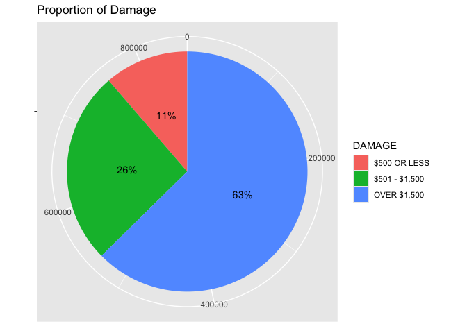<!-- -->

``` r
#plot histogram of crash type column in df
#change the y axis to show the count of each crash type
df %>% ggplot(aes(x=CRASH_TYPE , fill=MOST_SEVERE_INJURY)) + geom_bar()
```

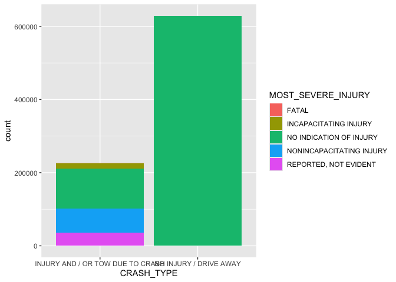<!-- -->

``` r
#plot histogram of damage column in df
df %>% ggplot(aes(x=DAMAGE, fill=MOST_SEVERE_INJURY)) + geom_bar()
```

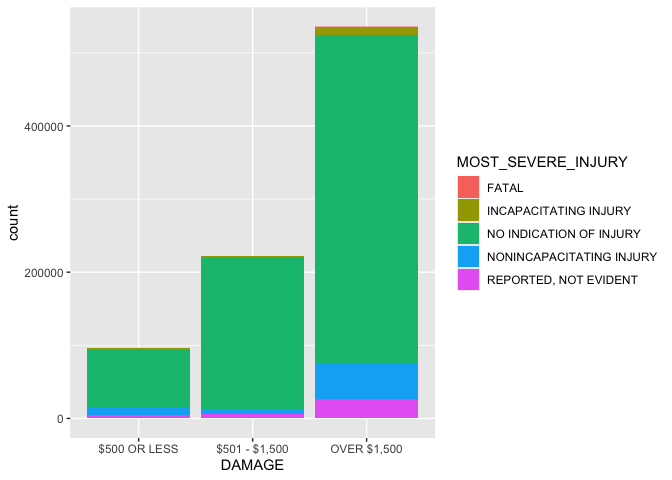<!-- -->

``` r
# Crash severity by road type
ggplot(df, aes(x = ROAD_DEFECT, fill = MOST_SEVERE_INJURY)) +
  geom_bar(position = "fill") +
  labs(title = "Crash Severity by Road Type",
       x = "Road Type", y = "Proportion") +
  theme(axis.text.x = element_text(angle = 45, hjust = 1))
```

<!-- -->

``` r
#crash by road defect
ggplot(df, aes(x = ROAD_DEFECT, fill = MOST_SEVERE_INJURY)) +
  geom_bar(position = "fill") +
  labs(title = "Crash Type by Road Defect",
       x = "Road Defect", y = "Proportion") +
  theme(axis.text.x = element_text(angle = 45, hjust = 1))
```

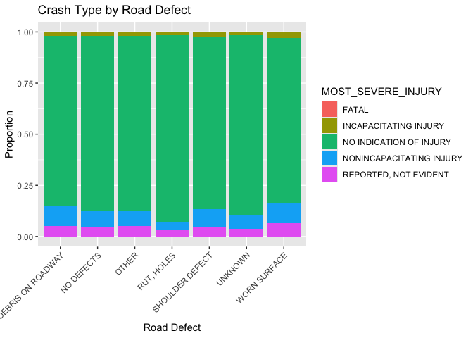<!-- -->

``` r
#damage by road defects
ggplot(df, aes(x = ROADWAY_SURFACE_COND, fill = DAMAGE)) +
  geom_bar(position = "fill") +
  labs(title = "Damage by Road Surface Condition",
       x = "Road Defect", y = "Proportion") +
  theme(axis.text.x = element_text(angle = 45, hjust = 1))
```

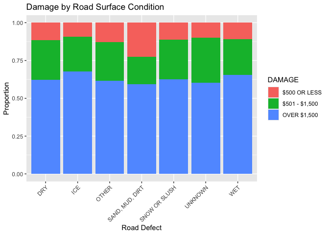<!-- -->

``` r
#damage by road_type
ggplot(df, aes(x = ROAD_DEFECT, fill = DAMAGE)) +
  geom_bar(position = "fill") +
  labs(title = "Roadway Surface Condition by Road Defect",
       x = "Road Defect", y = "Proportion") +
  theme(axis.text.x = element_text(angle = 45, hjust = 1))
```

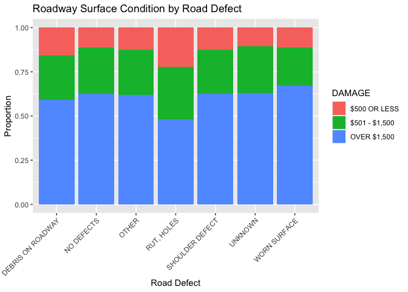<!-- -->

``` r
# Crash severity by lighting conditions
ggplot(df, aes(x = LIGHTING_CONDITION, fill = MOST_SEVERE_INJURY)) +
  geom_bar(position = "fill") +
  labs(title = "Crash Severity by Lighting Conditions",
       x = "Lighting Condition", y = "Proportion") +
  theme(axis.text.x = element_text(angle = 45, hjust = 1))
```

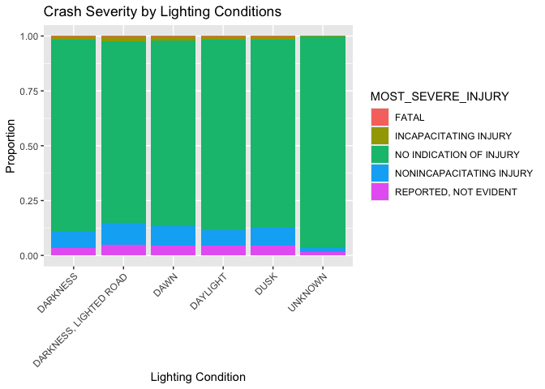<!-- -->

``` r
#damage by lighting conditions
ggplot(df, aes(x = LIGHTING_CONDITION, fill = DAMAGE)) +
  geom_bar(position = "fill") +
  labs(title = "Damage by Lighting Conditions",
       x = "Lighting Condition", y = "Proportion") +
  theme(axis.text.x = element_text(angle = 45, hjust = 1))
```

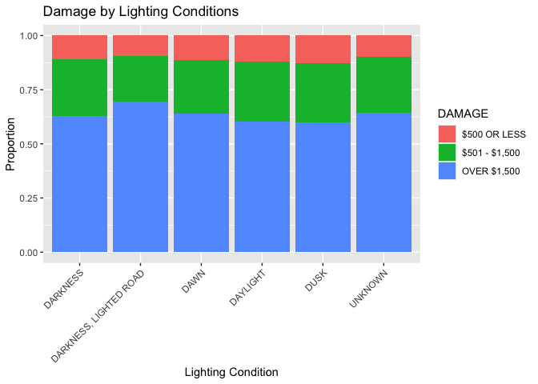<!-- -->

``` r
# Crash severity by weather conditions
ggplot(df, aes(x = WEATHER_CONDITION, fill = MOST_SEVERE_INJURY)) +
  geom_bar(position = "fill") +
  labs(title = "Crash Severity by Weather Conditions",
       x = "Weather Condition", y = "Proportion") +
  theme(axis.text.x = element_text(angle = 45, hjust = 1))
```

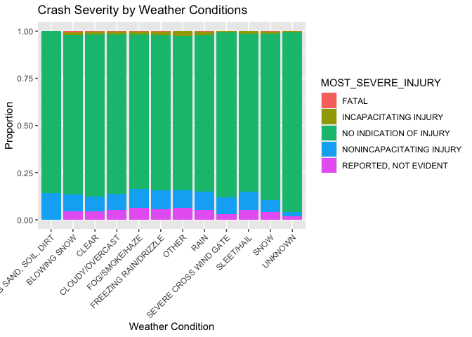<!-- -->

``` r
#damage by weather conditions
ggplot(df, aes(x = WEATHER_CONDITION, fill = DAMAGE)) +
  geom_bar(position = "fill") +
  labs(title = "Damage by Weather Conditions",
       x = "Weather Condition", y = "Proportion") +
  theme(axis.text.x = element_text(angle = 45, hjust = 1))
```

<!-- -->

``` r
# Crash severity by FIRST_CRASH_TYPE
ggplot(df, aes(x = FIRST_CRASH_TYPE, fill = MOST_SEVERE_INJURY)) +
  geom_bar(position = "fill") +
  labs(title = "Crash Severity by First Crash Type",
       x = "First Crash Type", y = "Proportion") +
  theme(axis.text.x = element_text(angle = 45, hjust = 1),legend.position = "bottom")
```

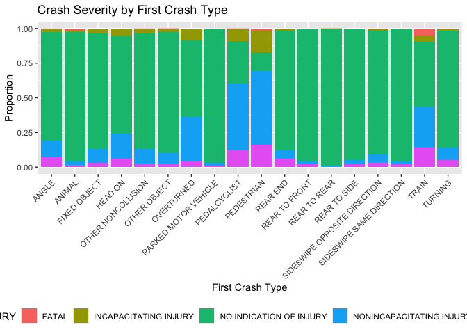<!-- -->

``` r
#damage by first crash type
ggplot(df, aes(x = FIRST_CRASH_TYPE, fill = DAMAGE)) +
  geom_bar(position = "fill") +
  labs(title = "Damage by First Crash Type",
       x = "First Crash Type", y = "Proportion") +
  theme(axis.text.x = element_text(angle = 45, hjust = 1),legend.position = "bottom")
```

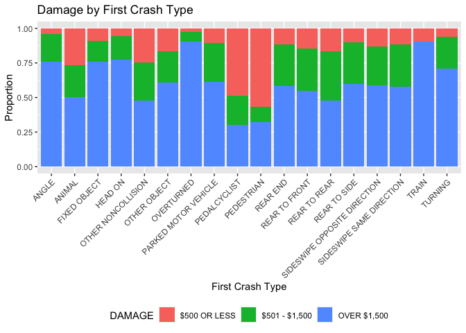<!-- -->

``` r
# Proportion of crash severities for different times of day

ggplot(df, aes(x = CRASH_HOUR , fill = MOST_SEVERE_INJURY)) +
  geom_bar(position = "fill") +
  scale_x_continuous(breaks = 0:23) +
  labs(title = "Crash Severity by Hour of Day",
       x = "Hour", y = "Proportion")
```

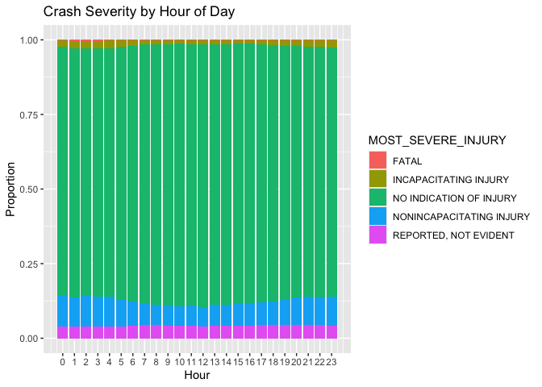<!-- -->

``` r
#damage by hour of day
ggplot(df, aes(x = CRASH_HOUR, fill = DAMAGE)) +
  geom_bar(position = "fill") +
  scale_x_continuous(breaks = 0:23) +
  labs(title = "Damage by Hour of Day",
       x = "Hour", y = "Proportion")
```

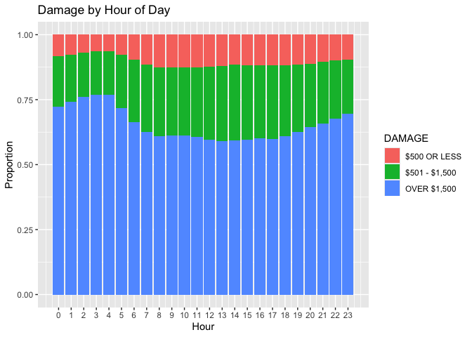<!-- -->

``` r
# Proportion of crash severities for different days of the week
ggplot(df, aes(x = CRASH_DAY_OF_WEEK, fill = MOST_SEVERE_INJURY)) +
  geom_bar(position = "fill") +
  scale_x_continuous(breaks = 1:7) +
  labs(title = "Crash Severity by Day of Week",
       x = "Day of Week", y = "Proportion") 
```

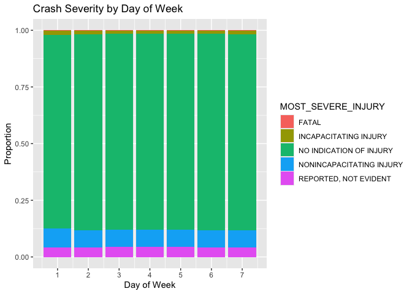<!-- -->

``` r
#damage by day of week
ggplot(df, aes(x = CRASH_DAY_OF_WEEK, fill = DAMAGE)) +
  geom_bar(position = "fill") +
  labs(title = "Damage by Day of Week",
       x = "Day of Week", y = "Proportion")
```

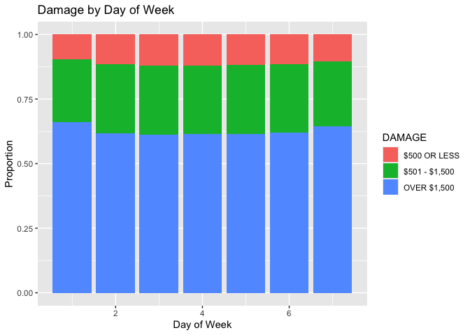<!-- -->

``` r
ggplot(df, aes(x = LONGITUDE, y = LATITUDE)) +
  #stat_density_2d(aes(fill = after_stat(level)), geom = "polygon") +
  geom_hex()+
  coord_fixed() +
  scale_fill_viridis_c() +
  theme_minimal() +
  labs(title = "Heat Map of Crash Locations in Chicago",
       x = "Longitude", y = "Latitude")
```

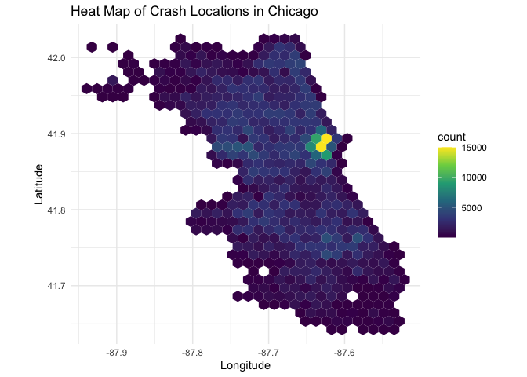<!-- -->

``` r
daily_crashes <- df %>%
  group_by(CRASH_DATE) %>%
  summarise(count = n())

ggplot(daily_crashes, aes(x = CRASH_DATE, y = count)) +
  geom_line() +
  labs(title = "Daily Crash Frequency Over Time",
       x = "Date", y = "Number of Crashes")
```

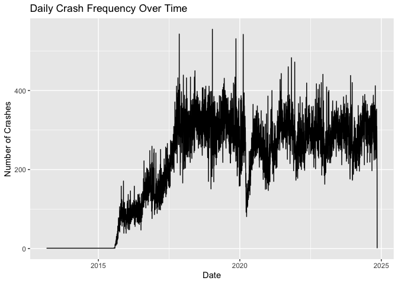<!-- -->

``` r
p1 <- ggplot(df, aes(x = CRASH_HOUR)) +
  geom_bar(fill='lightblue') +
  scale_x_continuous(breaks = 0:23) +
  scale_y_continuous(breaks = seq(0, 100000, by = 10000)) +
  labs(title = "Crash Frequency by Hour",
       x = "Hour of Day", y = "Number of Crashes")

p2 <- ggplot(df, aes(x = CRASH_DAY_OF_WEEK)) +
  geom_bar(fill="lightblue") +
  scale_x_continuous(breaks = 0:23) +
  scale_y_continuous(breaks = seq(0, 1000000, by = 10000)) +
  labs(title = "Crash Frequency by Day of Week",
       x = "Day of Week", y = "Number of Crashes")

p3 <- ggplot(df, aes(x = CRASH_MONTH)) +
  geom_bar(fill="lightblue") +
  scale_x_continuous(breaks = 1:12) +
  scale_y_continuous(breaks = seq(0, 1000000, by = 10000)) +
  labs(title = "Crash Frequency by Month",
       x = "Month", y = "Number of Crashes")

p4 <- ggplot(df[df$CRASH_YEAR>2015,], aes(x = CRASH_YEAR)) +
  geom_bar(fill="lightblue") +
  scale_x_continuous(breaks = 2013:2024) +
  scale_y_continuous(breaks = seq(0, 1000000, by = 10000)) +
  labs(title = "Crash Frequency by Year",
       x = "Year", y = "Number of Crashes")

grid.arrange(p1, p2, p3, p4, ncol = 2)
```

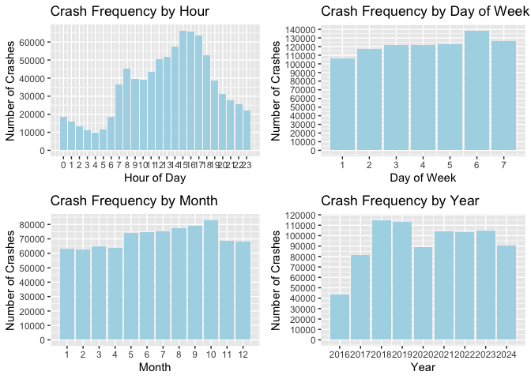<!-- -->

``` r
weather_crashes <- df %>%
  group_by(CRASH_MONTH, WEATHER_CONDITION) %>%
  summarise(count = n()) %>%
  mutate(proportion = count / sum(count))
```

    ## `summarise()` has grouped output by 'CRASH_MONTH'. You can override using the
    ## `.groups` argument.

``` r
ggplot(weather_crashes, aes(x = CRASH_MONTH, y = proportion, fill = WEATHER_CONDITION)) +
  geom_area() +
  theme_minimal() +
  scale_fill_brewer(palette = "Set3") +
  scale_x_continuous(breaks = 1:12) +
  labs(title = "Proportion of Crashes by Weather Condition Over Time",
       x = "Month", y = "Proportion of Crashes",
       fill = "Weather Condition")
```

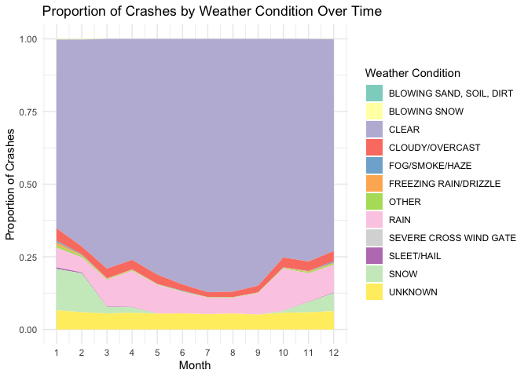<!-- -->

``` r
# weather_crashes <- df %>%
#   group_by(CRASH_MONTH, WEATHER_CONDITION) %>%
#   summarise(count = n()) %>%
#   mutate(proportion = count / sum(count))
# 
# ggplot(weather_crashes, aes(x = CRASH_MONTH, y = proportion, fill = WEATHER_CONDITION)) +
#   geom_area() +
#   theme_minimal() +
#   scale_fill_brewer(palette = "Set3") +
#   scale_x_continuous(breaks = 1:12) +
#   labs(title = "Proportion of Crashes by Weather Condition Over Time",
#        x = "Month", y = "Proportion of Crashes",
#        fill = "Weather Condition")
```

``` r
dmg_crash_sev <- df %>% select(DAMAGE, MOST_SEVERE_INJURY, SEASON, LATITUDE, LONGITUDE, CRASH_YEAR)
dmgsev_geo <- st_as_sf(dmg_crash_sev, coords = c("LONGITUDE", "LATITUDE"), crs = 4326, agr = "constant")
max_lat <- max(dmg_crash_sev$LATITUDE)
min_lat <- min(dmg_crash_sev$LATITUDE)
max_lon <- max(dmg_crash_sev$LONGITUDE)
min_lon <- min(dmg_crash_sev$LONGITUDE)

#comm.file <- "https://data.cityofchicago.org/resource/igwz-8jzy.geojson"
# comm.file <- "https://github.com/palewire/chicago-regions-map/blob/9306deeea4a205d89371e4464f6cc5f6b54917cf/output/regions.geojson"
 
# chicago <- read_sf(comm.file) %>% select(geometry)
chicago <- read_sf("regions.geojson")
dmg_sev_winter <- dmg_crash_sev %>% filter(SEASON == "WINTER")
dmg_sev_spring <- dmg_crash_sev %>% filter(SEASON == "SPRING")
dmg_sev_summer <- dmg_crash_sev %>% filter(SEASON == "SUMMER")
dmg_sev_fall <- dmg_crash_sev %>% filter(SEASON == "FALL")

dmg_sev_winter_23 <- dmg_crash_sev %>% filter(SEASON == "WINTER", CRASH_YEAR == 2023) 
dmg_sev_spring_23 <- dmg_crash_sev %>% filter(SEASON == "SPRING", CRASH_YEAR == 2023)
dmg_sev_summer_23 <- dmg_crash_sev %>% filter(SEASON == "SUMMER", CRASH_YEAR == 2023)
dmg_sev_fall_23 <- dmg_crash_sev %>% filter(SEASON == "FALL", CRASH_YEAR == 2023)
```

``` r
#plot the different damage categories on the chicago map for winter
# ggplot() +
#   geom_sf(data = chicago, fill = NA, color = "gray50") +
#   geom_point(data = dmg_sev_winter, aes(x = LONGITUDE, y = LATITUDE, color = DAMAGE),
#              alpha = 0.5) +
#   coord_sf() +
#   theme_minimal() +
#   labs(title = "Traffic Crash Damage in Chicago during Winter",
#        x = "Longitude", y = "Latitude", color = "Damage")

#2d density plot by season
d1 <- ggplot()+
  geom_sf(data = chicago, fill = NA, color = "gray50") +
  stat_density_2d(data = dmg_sev_winter, aes(x = LONGITUDE, y = LATITUDE, fill = ..level..), 
                  geom = "polygon", alpha = 0.5, h=0.01) +
  scale_fill_viridis_c() +
  coord_sf() +
  theme_minimal() +
  labs(title = "Density of Crashes in Chicago during Winter",
       x = "Longitude", y = "Latitude")
d1
```

    ## Warning: The dot-dot notation (`..level..`) was deprecated in ggplot2 3.4.0.
    ## ℹ Please use `after_stat(level)` instead.
    ## This warning is displayed once every 8 hours.
    ## Call `lifecycle::last_lifecycle_warnings()` to see where this warning was
    ## generated.

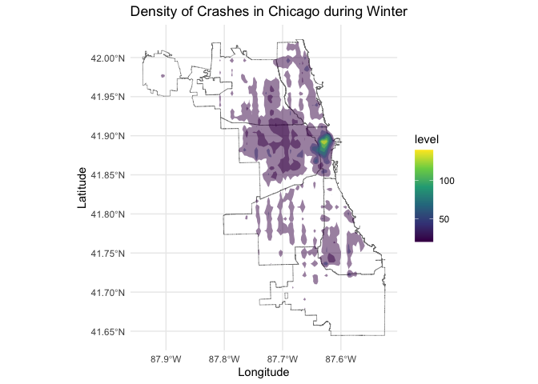<!-- -->

``` r
# ggplot() +
#   geom_sf(data = chicago, fill = NA, color = "gray50") +
#   geom_point(data = dmg_sev_spring, aes(x = LONGITUDE, y = LATITUDE, color = DAMAGE),
#              alpha = 0.5) +
#   coord_sf() +
#   theme_minimal() +
#   labs(title = "Traffic Crash Damage in Chicago during Spring",
#        x = "Longitude", y = "Latitude", color = "Damage")

d2 <- ggplot()+
  geom_sf(data = chicago, fill = NA, color = "gray50") +
  stat_density_2d(data = dmg_sev_spring, aes(x = LONGITUDE, y = LATITUDE, fill = ..level..), 
                  geom = "polygon", alpha = 0.5, h=0.01) +
  scale_fill_viridis_c() +
  coord_sf() +
  theme_minimal() +
  labs(title = "Density of Crashes in Chicago during Spring",
       x = "Longitude", y = "Latitude")
```

``` r
# ggplot() +
#   geom_sf(data = chicago, fill = NA, color = "gray50") +
#   geom_point(data = dmg_sev_summer, aes(x = LONGITUDE, y = LATITUDE, color = DAMAGE),
#              alpha = 0.5) +
#   coord_sf() +
#   theme_minimal() +
#   labs(title = "Traffic Crash Damage in Chicago during Summer",
#        x = "Longitude", y = "Latitude", color = "Damage")

d3 <- ggplot()+
  geom_sf(data = chicago, fill = NA, color = "gray50") +
  stat_density_2d(data = dmg_sev_summer, aes(x = LONGITUDE, y = LATITUDE, fill = ..level..), 
                  geom = "polygon", alpha = 0.5, h=0.01) +
  scale_fill_viridis_c() +
  coord_sf() +
  theme_minimal() +
  labs(title = "Density of Crashes in Chicago during Summer",
       x = "Longitude", y = "Latitude")
```

``` r
# ggplot() +
#   geom_sf(data = chicago, fill = NA, color = "gray50") +
#   geom_point(data = dmg_sev_fall, aes(x = LONGITUDE, y = LATITUDE, color = DAMAGE),
#              alpha = 0.5) +
#   coord_sf() +
#   theme_minimal() +
#   labs(title = "Traffic Crash Damage in Chicago during Fall",
#        x = "Longitude", y = "Latitude", color = "Damage")

d4 <- ggplot()+
  geom_sf(data = chicago, fill = NA, color = "gray50") +
  stat_density_2d(data = dmg_sev_fall, aes(x = LONGITUDE, y = LATITUDE, fill = ..level..), 
                  geom = "polygon", alpha = 0.5, h=0.01) +
  scale_fill_viridis_c() +
  coord_sf() +
  theme_minimal() +
  labs(title = "Density of Crashes in Chicago during Fall",
       x = "Longitude", y = "Latitude")
```

``` r
grid.arrange(d1, d2, d3, d4, ncol = 2)
```

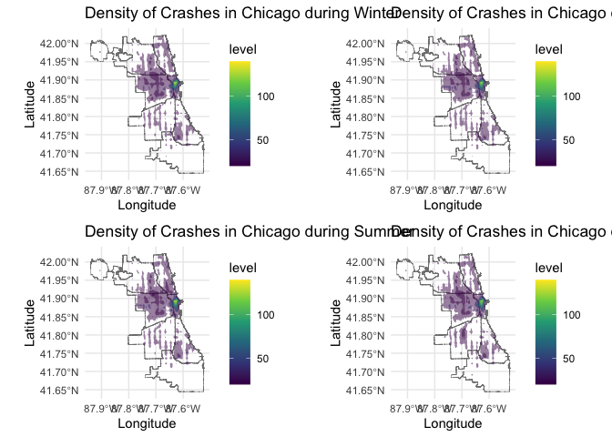<!-- -->

``` r
#plot by season but for only downtown area using downtown chicago map
# downtown_chitown <- chicago %>%
#   filter(name == c("River North","Gold Coast","Streetville","Lakeshore East", "The Loop","West Loop","South Loop"))

library(ggmap)
```

    ## ℹ Google's Terms of Service: <https://mapsplatform.google.com>
    ##   Stadia Maps' Terms of Service: <https://stadiamaps.com/terms-of-service/>
    ##   OpenStreetMap's Tile Usage Policy: <https://operations.osmfoundation.org/policies/tiles/>
    ## ℹ Please cite ggmap if you use it! Use `citation("ggmap")` for details.

``` r
register_stadiamaps(key="d5136c90-9249-4f01-bfc0-1c707460d62b")
```

``` r
dtchitown_map <- get_stadiamap(bbox = c(left = -87.73, bottom = 41.84, right = -87.60, top = 41.94),
                       zoom = 14,
                       maptype = "stamen_toner_lite")
```

    ## ℹ © Stadia Maps © Stamen Design © OpenMapTiles © OpenStreetMap contributors.

    ## ℹ 49 tiles needed, this may take a while (try a smaller zoom?)

``` r
#https://tiles.stadiamaps.com/static/alidade_bright.png?size=981x765@2x&center=41.87624749700046,-87.65191442321031&zoom=12&api_key=d5136c90-9249-4f01-bfc0-1c707460d62b
# dtchi <- get_stadiamap("https://tiles.stadiamaps.com/static/alidade_bright.png?size=981x765@2x&center=41.87624749700046,-87.65191442321031&zoom=12&api_key=d5136c90-9249-4f01-bfc0-1c707460d62b")
# ggmap("https://tiles.stadiamaps.com/static/alidade_bright.png?size=981x765@2x&center=41.87624749700046,-87.65191442321031&zoom=12&api_key=d5136c90-9249-4f01-bfc0-1c707460d62b")
```

``` r
ggmap(dtchitown_map)
```

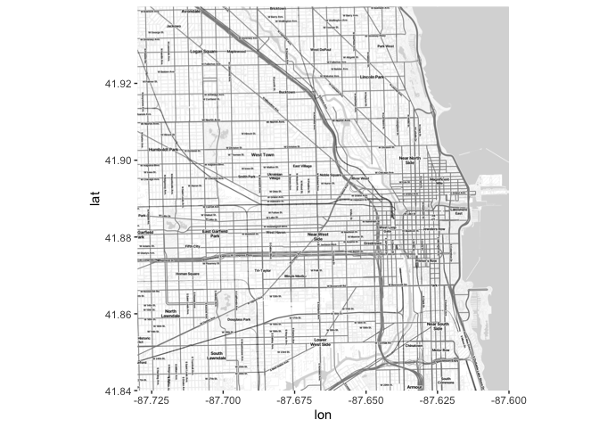<!-- -->

``` r
d1 <- ggmap(dtchitown_map) +
  # geom_point(data = dt_dmg_sev_winter, aes(x = LONGITUDE, y = LATITUDE, color = DAMAGE),
  #            alpha = 0.5) +
  stat_density_2d(data = dmg_sev_winter_23, aes(x = LONGITUDE, y = LATITUDE, fill = ..level..), 
                  geom = "polygon", alpha = 0.3, h=0.0033) +
  scale_fill_viridis_c(name="Frequency") +
  theme_minimal() +
  theme(legend.position = "bottom")+
  labs(title = "Density of Crashes during Winter 2023",
       x = "Longitude", y = "Latitude")

d1
```

    ## Warning: Removed 16796 rows containing non-finite outside the scale range
    ## (`stat_density2d()`).

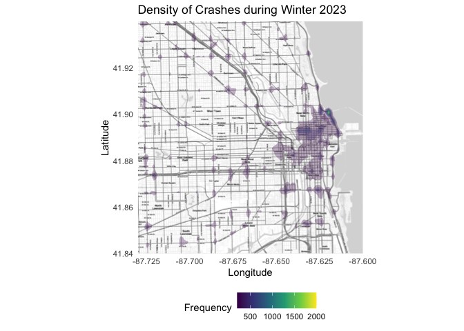<!-- -->

``` r
d2 <- ggmap(dtchitown_map) +
  # geom_point(data = dt_dmg_sev_spring, aes(x = LONGITUDE, y = LATITUDE, color = DAMAGE),
  #            alpha = 0.5) +
  stat_density_2d(data = dmg_sev_spring_23, aes(x = LONGITUDE, y = LATITUDE, fill = ..level..), 
                  geom = "polygon", alpha = 0.3, h=0.0033) +
  scale_fill_viridis_c(name="Frequency") +
  theme_minimal() +
  theme(legend.position = "bottom")+
  labs(title = "Density of Crashes during Spring 2023",
       x = "Longitude", y = "Latitude")

d2
```

    ## Warning: Removed 18317 rows containing non-finite outside the scale range
    ## (`stat_density2d()`).

<!-- -->

``` r
d3 <- ggmap(dtchitown_map) +
  # geom_point(data = dt_dmg_sev_summer, aes(x = LONGITUDE, y = LATITUDE, color = DAMAGE),
  #            alpha = 0.5) +
  stat_density_2d(data = dmg_sev_summer_23, aes(x = LONGITUDE, y = LATITUDE, fill = ..level..), 
                  geom = "polygon", alpha = 0.3, h=0.0033) +
  scale_fill_viridis_c(name="Frequnecy") +
  theme_minimal() +
  theme(legend.position = "bottom")+
  labs(title = "Density of Crashes during Summer 2023",
       x = "Longitude", y = "Latitude")

d3
```

    ## Warning: Removed 18544 rows containing non-finite outside the scale range
    ## (`stat_density2d()`).

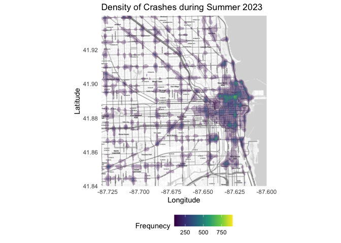<!-- -->

``` r
d4 <- ggmap(dtchitown_map) +
  # geom_point(data = dt_dmg_sev_fall, aes(x = LONGITUDE, y = LATITUDE, color = DAMAGE),
  #            alpha = 0.5) +
  stat_density_2d(data = dmg_sev_fall_23, aes(x = LONGITUDE, y = LATITUDE, fill = ..level..), 
                  geom = "polygon", alpha = 0.3, h=0.0033) +
  scale_fill_viridis_c(name="Frequency") +
  theme_minimal() +
  theme(legend.position = "bottom")+
  labs(title = "Density of Crashes during Fall 2023",
       x = "Longitude", y = "Latitude")

d4
```

    ## Warning: Removed 18574 rows containing non-finite outside the scale range
    ## (`stat_density2d()`).

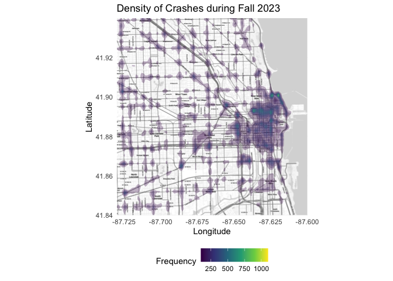<!-- -->
